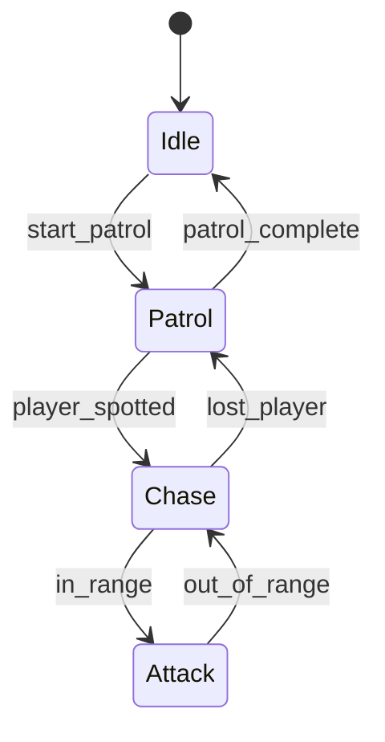
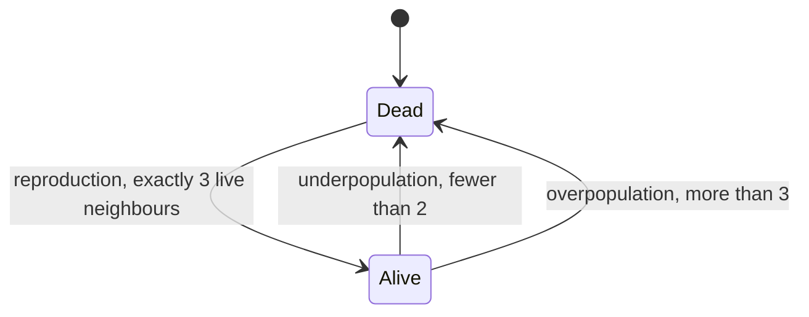

# State Machines


::: note "Preamble: Considerations on Level of Difficulty"

I do not cover State Machines in depth on the introductory AI class because in order to implement a good state machine involves:

- The best usecase is for animation control;
- Building a nice UI so you can visualize the states and transitions;
- Knowledge on advanced data structures such as graphs, trees, and a more specialized search algorithims;
- Delegates, Events, Callbacks and Pointer to Functions;
- A good implementation require some kind of hierarchy and some degree of concurrency / parallelism;

These topics can be really hard for some. So I will cover only the initial concepts and implementation. This topic will be all about States and Transitions.

On `Advanced AI for Games`, we will cover in depth this topic when we cover using this knowledge into planning such as in GOAP and HTN. I consider this topic limited applicability without these topics.

I rather allow the students to implement a simple state machine on their own that really works in a meaninful timeline than.

:::

## Motivation

State machines are fundamental to game AI, providing a clear way to model behavior that changes over time. They're perfect for NPCs, UI systems, and any game entity that needs to behave differently based on current conditions.



The assignment of this unit uses the very same machinery: every cell of Conway's Game of Life is an agent running a two-state machine.



Survival needs no arrow: when no transition fires, the cell simply stays in its state.

## Finite State Machines


**Finite** means a limited, predefined set of states. Each state represents a distinct behavior or condition.

```cpp
// Basic enemy AI states
enum class EnemyState {
    IDLE,
    PATROL,
    CHASE,
    ATTACK
};

class Enemy {
private:
    EnemyState currentState;
    float patrolTimer;
    
public:
    Enemy() : currentState(EnemyState::IDLE), patrolTimer(0.0f) {}
    
    void update(float deltaTime, bool playerVisible, float playerDistance) {
        switch (currentState) {
            case EnemyState::IDLE:
                if (patrolTimer <= 0) {
                    currentState = EnemyState::PATROL;
                    patrolTimer = 5.0f;
                }
                break;
                
            case EnemyState::PATROL:
                patrolTimer -= deltaTime;
                if (playerVisible) {
                    currentState = EnemyState::CHASE;
                } else if (patrolTimer <= 0) {
                    currentState = EnemyState::IDLE;
                }
                break;
                
            case EnemyState::CHASE:
                if (playerDistance < 2.0f) {
                    currentState = EnemyState::ATTACK;
                } else if (!playerVisible) {
                    currentState = EnemyState::PATROL;
                }
                break;
                
            case EnemyState::ATTACK:
                if (playerDistance > 2.0f) {
                    currentState = EnemyState::CHASE;
                }
                break;
        }
    }
};
```

::: warning "The naive switch does not scale"

The switch above is fine for four states, but it hardcodes the transition logic inside the entity. Adding a state means editing the switch; sharing transitions between entities means copy-pasting. That is exactly the "What NOT to Do" from the FSM assignment you already did. The rest of this lecture builds the replace­ment used in the Game of Life assignment: states, conditions, actions and transitions as objects.

:::

## States

A state defines **what** the agent does while in that situation. In the assignment a state is a shared, stateless node: it holds no per-agent data (which cell is in which state lives in the `World` grid), and its behavior is a set of **Actions** grouped by the moment they run:

- **entry actions** run when the agent enters the state;
- **stay actions** run on every update in which no transition fires (the "update" of the state);
- **exit actions** run when the agent leaves the state.

```cpp
class State {
    std::string name;
    std::vector<std::shared_ptr<Action>> entryActions;
    std::vector<std::shared_ptr<Action>> stayActions;
    std::vector<std::shared_ptr<Action>> exitActions;
    std::vector<Transition> transitions;

public:
    explicit State(std::string name);

    void AddTransition(std::shared_ptr<Condition> condition, std::shared_ptr<State> target,
                       std::vector<std::shared_ptr<Action>> actions = {});
    void AddEntryAction(std::shared_ptr<Action> action);
    void AddAction(std::shared_ptr<Action> action);  // stay action
    void AddExitAction(std::shared_ptr<Action> action);
};
```

Because states hold no per-agent data, every cell of the grid can share the same two `State` nodes — one `Alive`, one `Dead`.

## Transitions

Transitions define **when** to change states. A transition is registered on its **source** state (no `from` pointer needed) and carries three things: the condition that guards it, the target state, and the actions that run while crossing it.

```cpp
struct Transition {
    std::shared_ptr<Condition> condition;  // fires when Test(context) is true
    std::shared_ptr<State> target;
    std::vector<std::shared_ptr<Action>> actions;  // run between exit and entry
};

// wiring, from the assignment:
alive->AddTransition(std::make_shared<Underpopulation>(), dead, {die});
alive->AddTransition(std::make_shared<Overpopulation>(), dead, {die});
dead->AddTransition(std::make_shared<Reproduction>(), alive, {born});
```

## Actions and Conditions

Actions and conditions are the two sides of the machine. Conditions only **read** the world through the agent context; actions only **write** the next state. Keeping that split is what makes the double buffering safe.

```cpp
class Action {
public:
    virtual ~Action() = default;
    virtual void Execute(const AgentContext& context) = 0;
};

class Condition {
public:
    virtual ~Condition() = default;
    virtual bool Test(const AgentContext& context) = 0;
};
```

The `AgentContext` is the per-agent snapshot for one update: which cell (`position`), what it is (`isAlive`, synced from the world bit), and what it sees (`aliveNeighbors`).

## The State Machine

The machine holds the agent's current state as a cursor and runs one update: scan the current state's transitions in registration order; on the first condition that tests true, run exit actions, transition actions, entry actions, and move the cursor; if nothing fires, run the stay actions.

```cpp
bool StateMachine::Update(const AgentContext& context) {
    for (const Transition& transition : current->GetTransitions()) {
        if (transition.condition->Test(context)) {
            for (const auto& action : current->GetExitActions()) action->Execute(context);
            for (const auto& action : transition.actions) action->Execute(context);
            for (const auto& action : transition.target->GetEntryActions()) action->Execute(context);
            current = transition.target;
            return true;
        }
    }
    for (const auto& action : current->GetStayActions()) action->Execute(context);
    return false;
}
```

The caller (the rule's `Step`) builds one `AgentContext` per cell, points the machine at the state matching the world bit, and calls `Update`. The double-buffered `World` is the state store: conditions read the current generation, actions write the next one, and the driver calls `SwapBuffers` after the whole generation is computed.

## Performance Considerations

- For the states: `O(1)` time complexity because we use switches or pointer to the state.
- For transitions: `O(n)` time complexity where `n` is the number of transitions for the current state.

## Common Patterns

### Simple Toggle

```cpp
class ToggleState {
    bool isOn = false;
public:
    void toggle() { isOn = !isOn; }
    bool getState() const { return isOn; }
};
```

### Timer-Based Transitions

A timer is per-agent data, so it lives outside the stateless states — in the agent context or the world — and the transition is guarded by a `Condition`:

```cpp
class TimedOut : public Condition {
public:
    bool Test(const AgentContext& context) override { return context.timer >= context.duration; }
};

state->AddTransition(std::make_shared<TimedOut>(), nextState);
```

### Hierarchical State Machines

```cpp
class CombatState {
    enum SubState { MELEE, RANGED, BLOCKING };
    SubState currentSubState = MELEE;
    
public:
    void handleInput(InputType input) {
        switch (currentSubState) {
            case MELEE:
                if (input == InputType::BLOCK) currentSubState = BLOCKING;
                else if (input == InputType::SHOOT) currentSubState = RANGED;
                break;
            case RANGED:
                if (input == InputType::MELEE_ATTACK) currentSubState = MELEE;
                break;
            case BLOCKING:
                if (input == InputType::RELEASE_BLOCK) currentSubState = MELEE;
                break;
        }
    }
};
```

### State Stack (Pushdown Automaton)

```cpp
class StateStack {
    std::stack<GameState*> stateStack;
    
public:
    void pushState(GameState* state) {
        if (!stateStack.empty()) {
            stateStack.top()->pause();
        }
        stateStack.push(state);
        state->enter();
    }
    
    void popState() {
        if (!stateStack.empty()) {
            stateStack.top()->exit();
            stateStack.pop();
            if (!stateStack.empty()) {
                stateStack.top()->resume();
            }
        }
    }
};
```

### Guard Conditions

Guards are transitions whose condition reads more of the world than just the agent. In the assignment every guard is a `Condition` subclass over the `AgentContext`:

```cpp
class Reproduction : public Condition {
public:
    bool Test(const AgentContext& context) override { return context.aliveNeighbors == 3; }
};

// used as the guard of the Dead -> Alive transition
dead->AddTransition(std::make_shared<Reproduction>(), alive, {born});
```

### Event-Driven States

```cpp
class EventDrivenAI {
    enum State { IDLE, INVESTIGATING, ALERTING };
    State currentState = IDLE;
    
public:
    void onEvent(EventType event) {
        switch (currentState) {
            case IDLE:
                if (event == EventType::NOISE_HEARD) {
                    currentState = INVESTIGATING;
                }
                break;
            case INVESTIGATING:
                if (event == EventType::PLAYER_SPOTTED) {
                    currentState = ALERTING;
                } else if (event == EventType::INVESTIGATION_COMPLETE) {
                    currentState = IDLE;
                }
                break;
            case ALERTING:
                if (event == EventType::PLAYER_ESCAPED) {
                    currentState = IDLE;
                }
                break;
        }
    }
};
```

## The Assignment: Game of Life

Everything above is implemented in `apps/life/` — the lecture and the assignment share the same classes.

| Machine part | Where it lives |
| --- | --- |
| `State`, `Transition` | `apps/life/fsm/State.h` |
| `StateMachine` (the update loop above) | `apps/life/fsm/StateMachine.h` |
| `Action`, `Condition`, `AgentContext` | `apps/life/fsm/Action.h`, `Condition.h`, `AgentContext.h` |
| Conway conditions (`Underpopulation`, `Overpopulation`, `Reproduction`) and actions (`Die`, `Born`, stay actions) | `apps/life/rules/JohnConway.cpp` |
| The per-cell update loop and neighbor counting | `JohnConway::Step` and `JohnConway::CountNeighbors` |
| The state store (double-buffered grid) | `apps/life/World.h` |

Your work sits inside `// begin solution` / `// end solution` regions. Edit, rebuild and grade yourself in one loop:

```bash
cmake --build build --parallel --target life-tests
./build/bin/life-tests
```

The runner prints one PASS/REJECT line per fixture and grade-ready `Passed:` / `Failed:` counts. See [the assignment README](README.md) for the full rules and grading.

## Use Cases

**Game Development:**
- Enemy AI (patrol → chase → attack)
- Player states (idle → running → jumping)
- Game flow (menu → playing → paused → game over)

**Other Applications:**
- Network protocols
- User interface flows
- Hardware control systems
- Parsing and compilation

::: tip "When to Use State Machines"

Use state machines when you have:
- Clear, discrete states
- Well-defined transitions
- Behavior that changes based on current state
- Need for predictable, debuggable logic

:::

## References

- Game Programming Patterns - [State Machines](https://gameprogrammingpatterns.com/state.html)
- Millington, *AI for Games*, ch. 5 — the Condition/Action/Transition decomposition used in the assignment
- [Assignment README](README.md) — rules, grading and edit/test loop